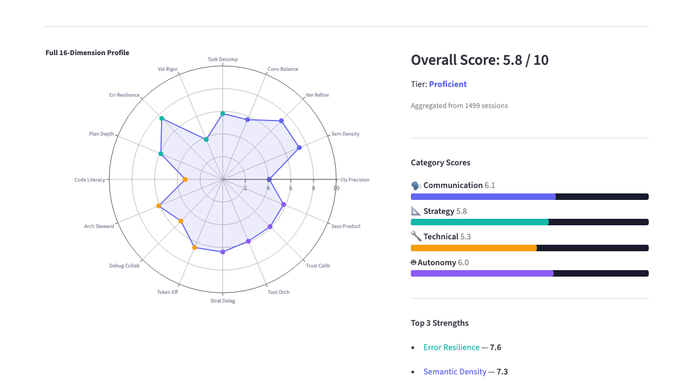
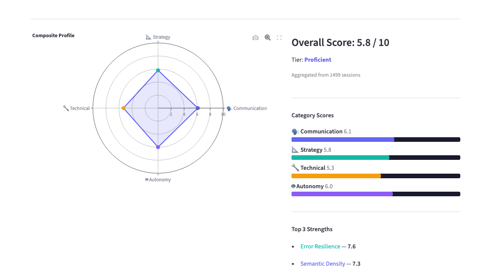

<div align="center">

# Claudealytics

[](https://github.com/sergei1503/claudealytics/actions/workflows/ci.yml)
[](https://www.python.org/downloads/)
[](https://pypi.org/project/claudealytics/)
[](LICENSE)

**See how you collaborate with Claude Code.**
All analysis runs locally on your machine.

<p>
  
  &nbsp;&nbsp;
  
</p>

<em>Your collaboration profile across 16 dimensions — generated from your local Claude Code data</em>

</div>

## Get Started

```bash
uvx claudealytics stats
```

That's it. No API keys, no sign-up, no config. One command that analyzes your local Claude Code data (`~/.claude/`) and shows your 16-dimension collaboration score right in the terminal.

Want the full visual experience with spider charts and deep analytics?

```bash
pip install 'claudealytics[dashboard]'
claudealytics dashboard
```

Alternative ways to run:
```bash
pipx run claudealytics stats         # via pipx
pip install claudealytics && claudealytics stats  # traditional
```

## What Gets Scored

Your collaboration style across 8 dimensions, grouped into 4 categories:

| Category | Dimensions | What it measures |
|----------|-----------|-----------------|
| **Technical** | Cache Efficiency, Error Rate | How well you leverage caching, how cleanly sessions run |
| **Strategy** | Read Before Write, Token Efficiency, Model Balance | Do you read before editing? Use models efficiently? |
| **Communication** | Config Health | How well-structured your Claude setup is |
| **Autonomy** | Autonomy & Efficiency, Agent & Skill Utilization | How independently Claude works for you, how much you use agents/skills |

Scores combine into an overall rating (0-100) with a radar chart showing your strengths.

## Local Dashboard

The full Streamlit dashboard gives you token breakdowns, cost tracking, session insights, and more:

```bash
pip install 'claudealytics[dashboard]'
claudealytics dashboard
```

<p align="center">
  <a href="#screenshots"></a>
  <a href="#screenshots"></a>
  <a href="#screenshots"></a>
  <a href="#screenshots"></a>
</p>

<details>
<summary>More screenshots</summary>

| | |
|---|---|
|  **Report** — LLM-scored health assessment |  **Config Health** |
|  **Daily Input Tokens** |  **Cache Hit Rate** |
|  **Daily Tool Calls** |  **Tool Usage by Type** |
|  **Read-Before-Write** |  **Complexity Over Time** |
|  **Language Trend** |  **Ecosystem Signals** |

</details>

## Share & Compare

Want to see how you compare? Publish your profile to the community leaderboard:

```bash
claudealytics publish
```

This computes your scores and opens a browser where you claim your profile on [guilder.dev](https://guilder.dev/community). Only computed scores are shared — your conversations, file contents, and personal data never leave your machine.

## All CLI Commands

```bash
claudealytics stats               # Quick terminal summary
claudealytics dashboard           # Launch full Streamlit dashboard (requires [dashboard] extra)
claudealytics publish             # Publish your score to guilder.dev
claudealytics scan                # Infrastructure scan (agents, skills, routing)
claudealytics optimize            # Optimization analysis (markdown report)
claudealytics export-json         # Export raw data as JSON
```

## How It Works

Claudealytics reads local Claude Code data — no external API calls for analysis.

| Source | Location | What's analyzed |
|--------|----------|----------------|
| Stats cache | `~/.claude/stats-cache.json` | Usage statistics |
| Conversations | `~/.claude/projects/*/` | Tool usage, content patterns |
| Execution logs | `~/.claude/execution-logs/` | Agent/skill executions |
| Config files | `~/.claude/agents/`, `~/.claude/skills/`, `CLAUDE.md` | Setup quality |

## Development

```bash
git clone https://github.com/sergei1503/claudealytics.git
cd claudealytics
uv sync --extra dev --extra test --extra dashboard
uv run pytest -v
```

See [CONTRIBUTING.md](CONTRIBUTING.md) for the full guide.

## License

MIT — see [LICENSE](LICENSE) for details.
