# Claudealytics

[](https://github.com/sergei1503/claudealytics/actions/workflows/ci.yml)
[](https://www.python.org/downloads/)
[](LICENSE)

Analytics dashboard for Claude Code power users. Mine your local conversation history to understand usage patterns, track costs, and optimize your workflow.

> **Privacy first** — all analysis runs locally. No data leaves your machine.

## Quick Start

```bash
pip install claudealytics
claudealytics dashboard
```

## What You Get

- **LLM-generated report** with a scored health assessment across 8 dimensions
- **Token & cache analytics** — input/output breakdown by model, cache hit rates, cost savings
- **Session insights** — tool call patterns, duration trends, hourly heatmaps
- **Conversation analysis** — agentic loops, read-before-write discipline, complexity scoring
- **Tech stack profiling** — language distribution, ecosystem signals, testing discipline
- **Agent & skill tracking** — usage frequency, trends, inventory, unmapped detection
- **Config health** — file sizes, growth history, quality issues

## Screenshots

<table>
<tr>
<td width="50%"><strong>Report</strong><br>LLM-scored health assessment<br>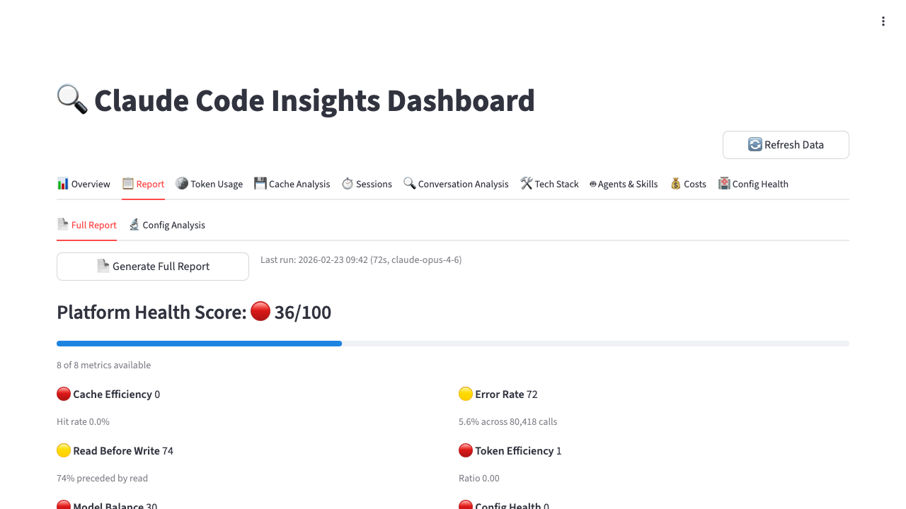</td>
<td width="50%"><strong>Config Health</strong><br>File sizes and quality issues<br>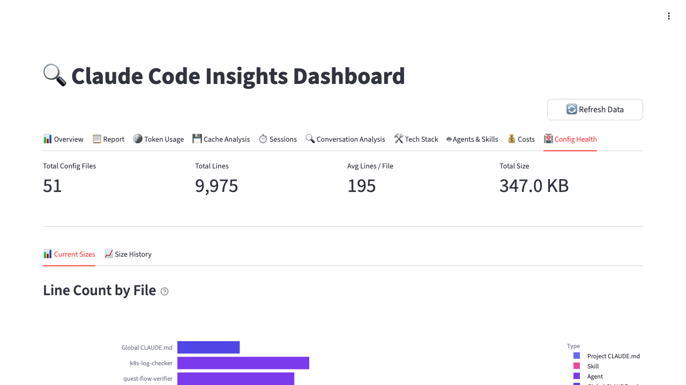</td>
</tr>
<tr>
<td><strong>Daily Input Tokens</strong><br>Token consumption by model<br>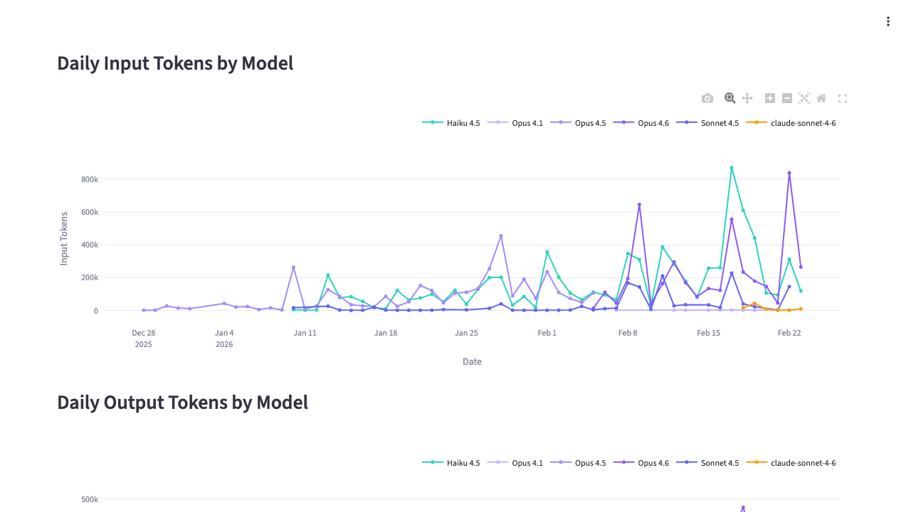</td>
<td><strong>Cache Hit Rate</strong><br>Daily cache efficiency<br>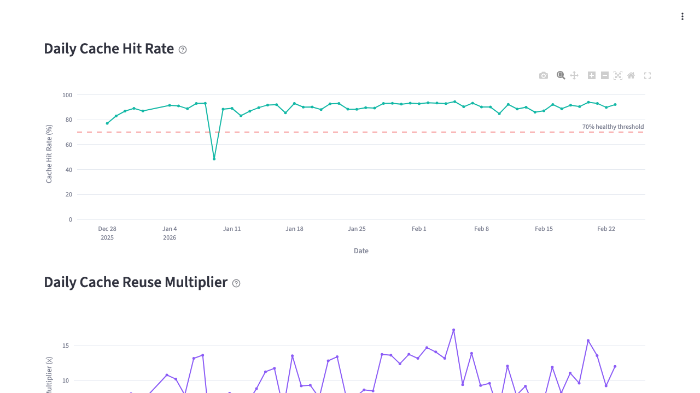</td>
</tr>
<tr>
<td><strong>Daily Tool Calls</strong><br>Tool usage over time<br>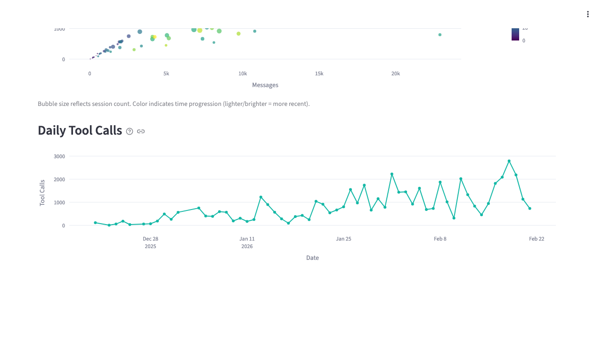</td>
<td><strong>Tool Usage by Type</strong><br>Read/write/execute breakdown<br>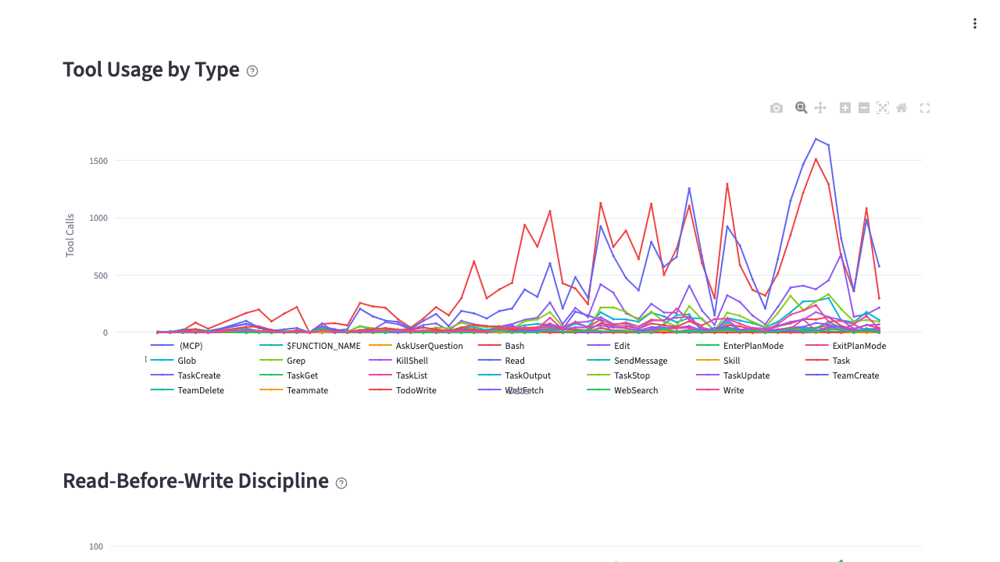</td>
</tr>
<tr>
<td><strong>Read-Before-Write</strong><br>Code discipline tracking<br>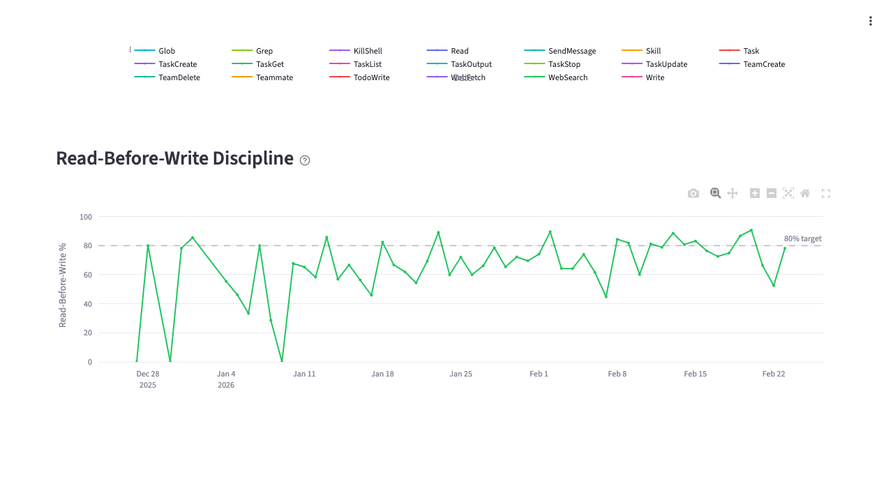</td>
<td><strong>Complexity Over Time</strong><br>Session complexity trends<br>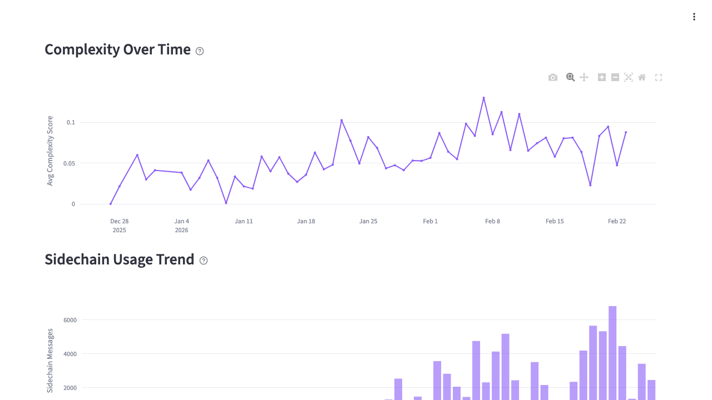</td>
</tr>
<tr>
<td><strong>Language Trend</strong><br>Language distribution over time<br>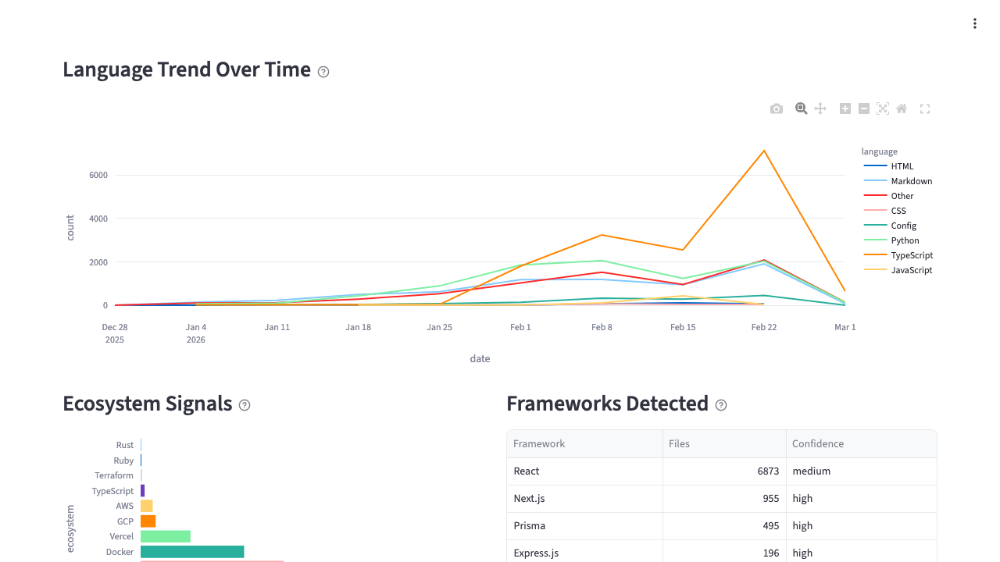</td>
<td><strong>Ecosystem Signals</strong><br>Framework and tool detection<br>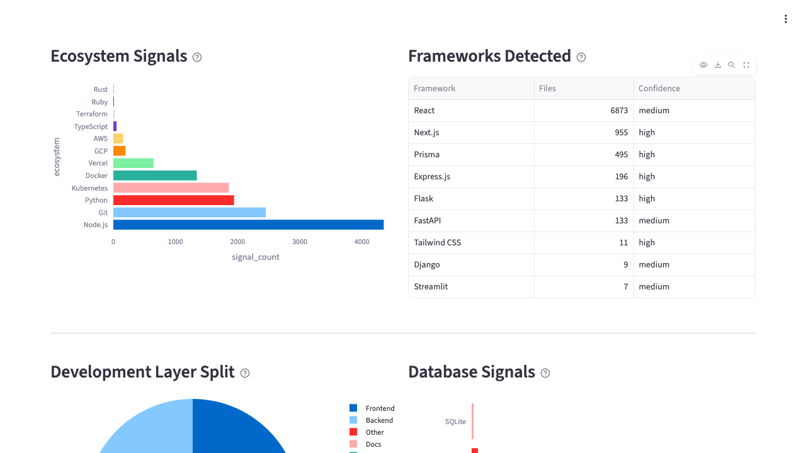</td>
</tr>
<tr>
<td colspan="2" align="center"><strong>Agent Usage Over Time</strong><br>Agent invocation trends<br>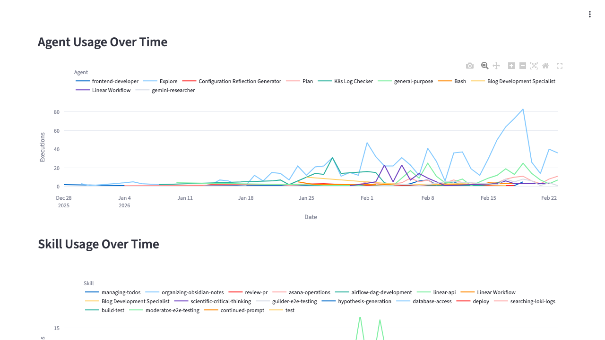</td>
</tr>
</table>

## CLI Commands

```bash
claudealytics dashboard           # Launch interactive dashboard
claudealytics scan                # Infrastructure scan (agents, skills, routing)
claudealytics optimize            # Optimization analysis (markdown report)
claudealytics stats               # Quick terminal summary
claudealytics tools               # Check external tool versions
```

## How It Works

Claudealytics reads local Claude Code data — no external API calls required (the Report tab optionally uses `claude` CLI for LLM synthesis).

| Source | Location | Purpose |
|--------|----------|---------|
| Stats cache | `~/.claude/stats-cache.json` | Pre-aggregated usage statistics |
| Conversation archives | `~/.claude/projects/*/` | Historical tool usage, content mining |
| Execution logs | `~/.claude/execution-logs/` | Recent agent/skill executions |
| Agent/skill definitions | `~/.claude/agents/`, `~/.claude/skills/` | Configuration inventory |
| CLAUDE.md files | `~/.claude/CLAUDE.md` + project dirs | Routing rules and configuration |

## Development

```bash
git clone https://github.com/sergei1503/claudealytics.git
cd claudealytics
uv sync --extra dev --extra test
uv run pytest -v
```

See [CONTRIBUTING.md](CONTRIBUTING.md) for the full guide.

## License

MIT — see [LICENSE](LICENSE) for details.
