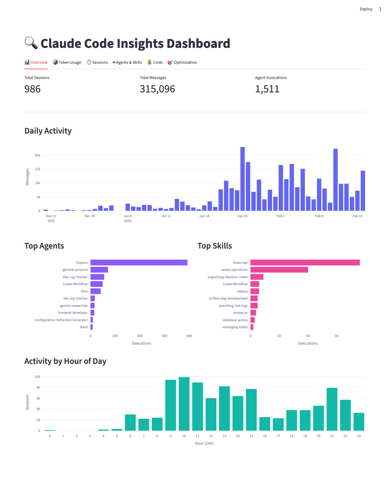
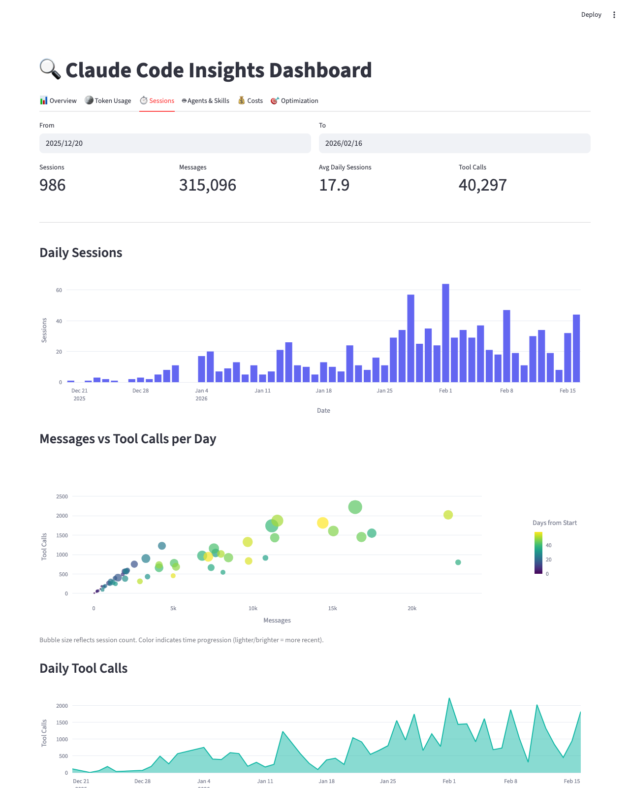
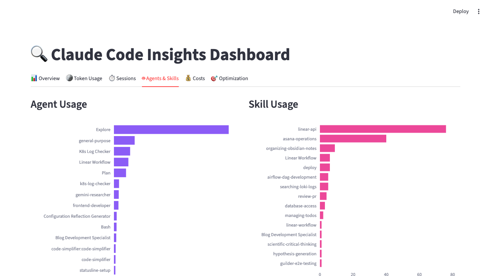
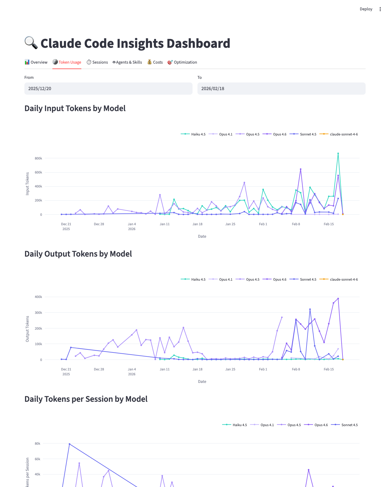
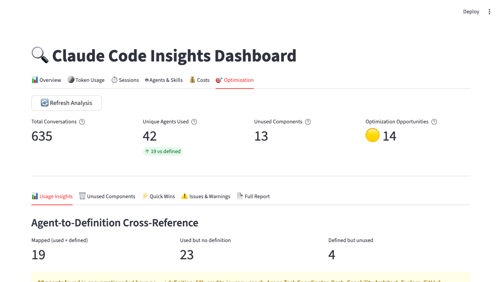

# Claude Code Insights

Analytics dashboard for Claude Code power users. Mine your local conversation history to understand usage patterns, track costs, and find optimization opportunities.

## Screenshots

| Overview | Sessions | Agents & Skills |
|----------|----------|-----------------|
|  |  |  |

## Quick Start

```bash
git clone https://github.com/sergei1503/claude_setup_insights.git
cd claude_setup_insights
uv sync
uv run claude-insights dashboard
```

Open http://localhost:8501 in your browser.

## Dashboard Tabs

**Overview** - KPI cards (sessions, messages, agent invocations) and daily activity chart.

**Token Usage** - Token consumption breakdown by model over time, with input/output/cache split.


**Sessions** - Session duration patterns and tool call frequency analysis.


**Agents & Skills** - Which agents and skills you actually use, how often, and usage trends. Dismiss historic/unused unmapped agents and skills with persistent preferences.


**Config Health** - Monitor your configuration files with current size metrics (scatter plot, histogram, table), size history tracking (total lines over time, stacked area by type, per-file trends), and in-depth analysis (quality issues grouped by pattern, complexity metrics, LLM-powered reviews, cross-file consistency checks).

**Optimization** - Data-driven recommendations for improving your Claude Code setup. Quality issues are grouped by message pattern for clarity, and failed LLM reviews are collapsed into a single summary.


## CLI Commands

```bash
claude-insights dashboard          # Launch interactive dashboard
claude-insights optimize           # Run optimization analysis (outputs markdown report)
claude-insights scan               # Infrastructure scan (agents, skills, routing)
claude-insights stats              # Quick terminal summary
```

## How It Works

The tool reads local Claude Code data - no external API calls required.

| Source | Location | Purpose |
|--------|----------|---------|
| Execution logs | `~/.claude/execution-logs/` | Recent agent/skill executions |
| Conversation archives | `~/.claude/projects/*/` | Historical tool usage patterns |
| Agent definitions | `~/.claude/agents/` | Configured agents and tools |
| Skill definitions | `~/.claude/skills/` | Available skills |
| Stats cache | `~/.claude/stats-cache.json` | Pre-aggregated usage statistics |
| CLAUDE.md files | `~/.claude/CLAUDE.md` + project dirs | Routing rules and configuration |

## Development

```bash
uv sync              # Install dependencies
uv run pytest        # Run tests
uv run ruff format src/  # Format code
```

## Privacy & Known Issues

All analysis runs locally - no data leaves your machine.

- Stats cache may not cover full history if Claude Code was recently installed
- Token/cost data is estimated based on public API pricing
- Some built-in agents may not have configuration files to analyze

## Roadmap

- [ ] Export optimization recommendations to Claude-compatible format
- [ ] Trend analysis for usage patterns
- [ ] Team usage analytics
- [ ] Performance benchmarking between agents
- [ ] Custom optimization rules

## License

MIT - see LICENSE file for details.

---
