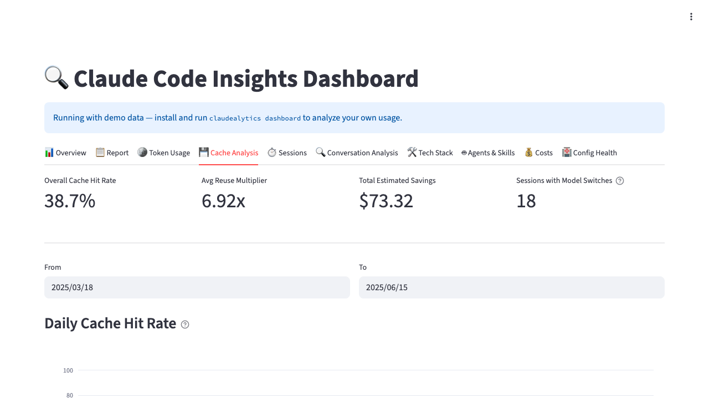
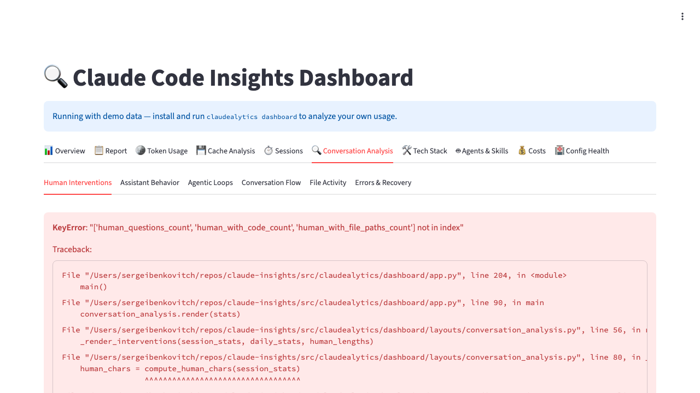
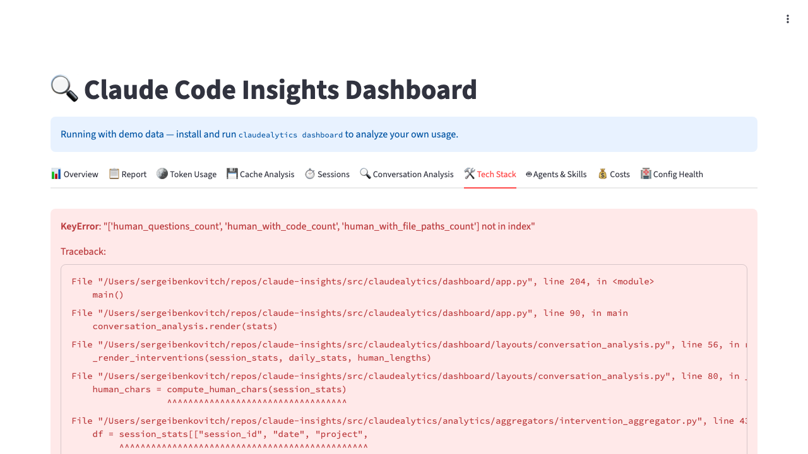
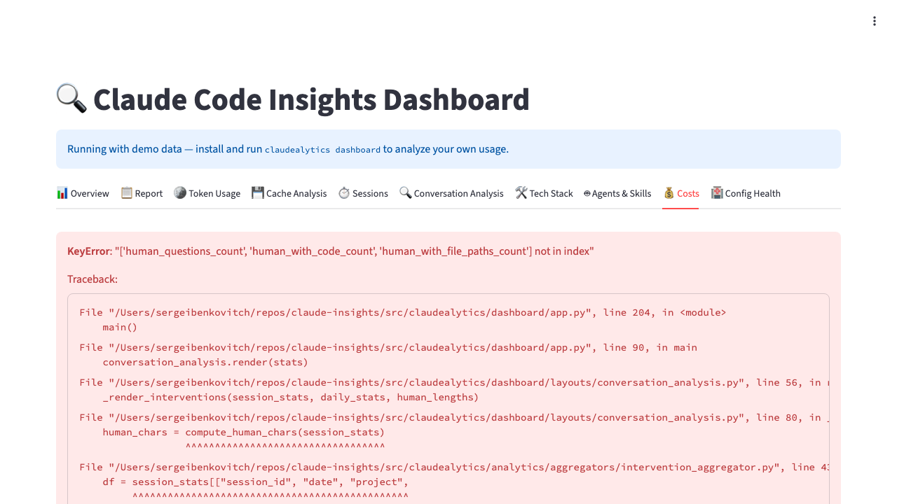

# Claudealytics Screenshots

All screenshots captured in demo mode (`claudealytics dashboard --demo`).

## Overview

KPI cards (sessions, messages, costs), daily activity chart, model distribution, and hourly heatmap.

## Report

LLM-generated platform analysis: executive summary, cost optimization, workflow friction points, and prioritized action plan.

## Token Usage

Daily input/output tokens by model, efficiency ratios, tokens per session/message, and cache efficiency overview.

## Cache Analysis

Cache hit rates, reuse multipliers, TTL distribution, cost savings, per-session and per-project cache efficiency.

## Sessions

Session duration distribution, tool call frequency, daily session count, and session length over time.

## Conversation Analysis

Six sub-tabs: human interventions (autonomy ratio, correction types), assistant behavior (thinking usage, output trends), agentic loops (tool usage, read-before-write discipline), conversation flow (complexity scores, sidechains), file activity (hot files, co-access), and errors & recovery.

## Tech Stack

Five sub-tabs: stack overview (languages, frameworks, ecosystem, FE/BE ratio), libraries & dependencies, testing discipline (TDD rate, framework distribution), research & learning (web searches, documentation sources), and code change semantics.

## Agents & Skills

Usage frequency, daily trends, execution timeline, agent/skill definitions inventory, and unmapped detection.

## Costs

Estimated cost by model, daily cost trend, cumulative spending, and cost-per-session analysis.

## Config Health

Current file sizes, type distribution, growth history over time, and per-file tracking.

